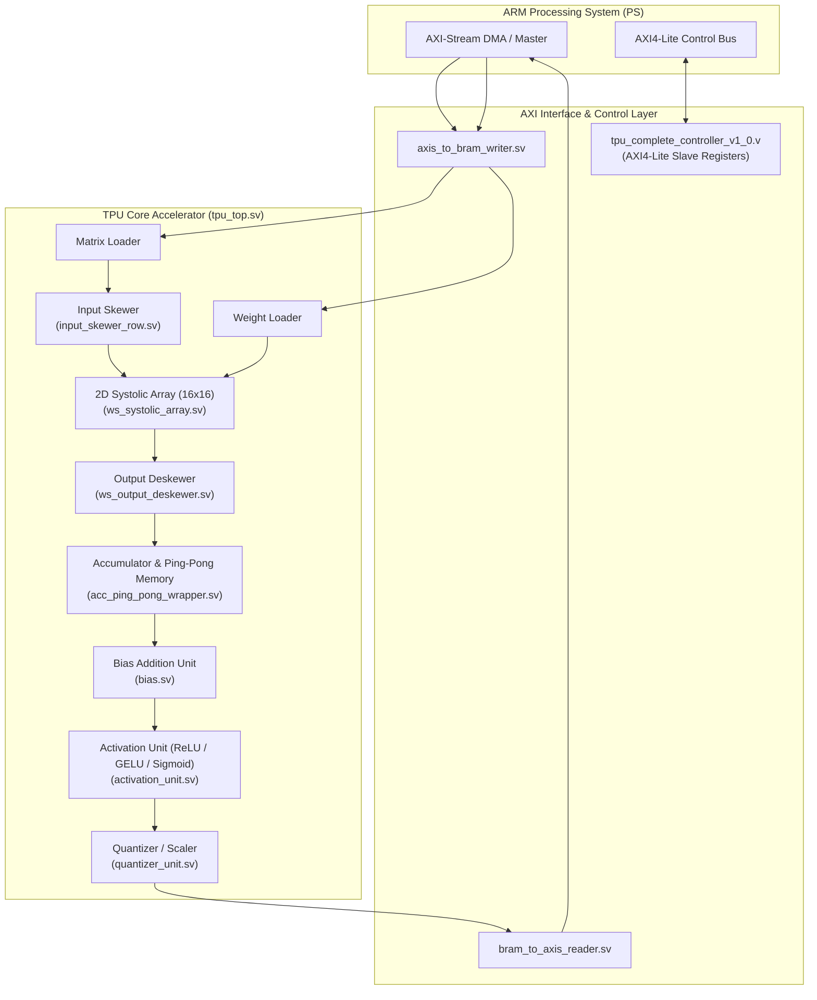

# Zynq TPU & Systolic Array Accelerator

> **A high-performance, matrix-multiplication hardware accelerator featuring a 2D Weight-Stationary Systolic Array, AXI-Stream interfaces, ping-pong memory buffering, and activation/quantization pipelines designed for Xilinx Zynq-7000 SoCs.**

[](#)
[](#)
[](#)
[](#)

---

## Overview

The **Zynq TPU Accelerator** is a parameterizable deep learning matrix-multiplication coprocessor implemented in synthesizable SystemVerilog. Designed to offload General Matrix Multiply (GEMM), Convolution, and Dense layer workloads from the ARM Processing System (PS) to the Programmable Logic (PL) on Xilinx Zynq-7000 SoCs, it features a 2D systolic compute grid, concurrent input/output skewing, ping-pong double-buffering, and modular non-linear activation/quantization pipelines.



---

## Key Architecture Features

- **2D Weight-Stationary Systolic Array (`ws_systolic_array.sv`, `ws_systolic_pe.sv`)**:
  - $16 \times 16$ processing grid of Multiply-Accumulate (MAC) processing elements.
  - Weights are preloaded and pinned in local registers while activations stream horizontally and partial sums propagate vertically.
  - Maximizes data reuse and minimizes memory bandwidth bottlenecks.
- **Dataflow & Skewing Pipeline (`input_skewer_row.sv`, `ws_output_deskewer.sv`)**:
  - Automatically skews spatial vector inputs across rows to align wave-front timing within the systolic array.
  - De-skews outgoing column results into synchronized matrix rows for downstream post-processing.
- **Memory Management & Double-Buffering (`acc_ping_pong_wrapper.sv`, `bram.sv`, `ping_pong_memory.sv`)**:
  - High-throughput ping-pong BRAM buffers enabling concurrent computation and AXI DMA transfer.
  - Parametric accumulator controller (`accumulator_ctrl.sv`) managing multi-pass large matrix partitioning.
- **Hardware Post-Processing Units**:
  - **Activation Unit (`activation_unit.sv`)**: Supports linear pass-through, ReLU, and lookup-table (LUT) accelerated non-linear activations including **GELU** (`gelu_table.mem`) and **Sigmoid** (`sigmoid_table.mem`).
  - **Quantizer Unit (`quantizer_unit.sv`)**: Fixed-point scaling, rounding, and saturation converting 32-bit accumulator outputs back to 8-bit quantized representations.
- **ARM Processing System (PS) Integration (`tpu_complete_controller_v1_0.v`)**:
  - Memory-mapped AXI4-Lite control interface for runtime matrix dimension configuration, execution triggering, and interrupt generation.
  - 64-bit high-bandwidth AXI-Stream channels for continuous weight, activation, and result streaming via AXI DMA.

---

## Known Issues & Limitations

> [!WARNING]
> **Bias Addition Unit (`bias.sv`) Under Review**  
> The current hardware implementation of the bias addition stage has a known synchronization / data-alignment limitation under specific multi-tile matrices. It is currently under active review and slated for a comprehensive revision in an upcoming update. If performing multi-tile matrix multiplication, bias addition can optionally be bypassed or handled in software.

---

## Repository Structure

```text
Zynq-TPU-Accelerator/
├── rtl/                                    # Synthesizable RTL source files & memory LUTs
│   ├── accumulator_ctrl.sv                 # Accumulation sequencing & address control
│   ├── accumulator_wrapper.sv              # Top wrapper for accumulation pipelines
│   ├── acc_bram.sv                         # Dual-port accumulator BRAM block
│   ├── acc_ping_pong_wrapper.sv            # Double-buffering accumulator wrapper
│   ├── activation_unit.sv                  # Activation pipeline (ReLU, GELU, Sigmoid)
│   ├── axis_to_bram_writer.sv              # Inbound AXI-Stream to internal BRAM writer
│   ├── bias.sv                             # Bias adder unit (Under Revision)
│   ├── bram.sv                             # Parameterizable dual-port BRAM primitive
│   ├── bram_to_axis_reader.sv              # Outbound BRAM to AXI-Stream streamer
│   ├── fifo_axis.sv                        # AXI-Stream compliant synchronous FIFO
│   ├── gelu_table.mem                      # Hardware LUT initialization for GELU activation
│   ├── input_skewer_col.sv                 # Column-wise input skewing shift registers
│   ├── input_skewer_row.sv                 # Row-wise input skewing shift registers
│   ├── matrix_loader.sv                    # Activation matrix streaming controller
│   ├── output_store_unit.sv                # Post-array output consolidation unit
│   ├── ping_pong_memory.sv                 # General-purpose ping-pong memory bank
│   ├── quantizer_unit.sv                   # 32-bit to 8-bit quantization & clamp unit
│   ├── sigmoid_table.mem                   # Hardware LUT initialization for Sigmoid activation
│   ├── simple_fifo.sv                      # Synchronous FIFO memory primitive
│   ├── tpu_complete_controller_v1_0.v      # Top-level AXI IP wrapper for Zynq BD
│   ├── tpu_complete_controller_v1_0_S00_AXI.v # AXI4-Lite slave register interface
│   ├── tpu_top.sv                          # Core TPU accelerator top-level module
│   ├── weight_loader.sv                    # Weight buffer loading and sequencing
│   ├── ws_output_deskewer.sv               # Triangular deskewing delay line
│   ├── ws_systolic_array.sv                # 16x16 Weight-Stationary 2D systolic array
│   └── ws_systolic_pe.sv                   # Processing Element (MAC + registers)
│
└── sim/                                    # Verification testbenches
    ├── tb_bram_to_axis_reader.sv           # Unit testbench for BRAM to AXI-Stream reader
    └── tb_tpu_system.sv                    # Full end-to-end system simulation testbench
```

---

## Hardware Specifications

| Feature | Specification |
| :--- | :--- |
| **Architecture** | 2D Weight-Stationary Systolic Array |
| **Grid Dimensions** | $16 \times 16$ (256 MAC Units) |
| **Data Widths** | 8-bit Signed (Weights & Activations), 32-bit Signed (Accumulators) |
| **Interface Widths** | 64-bit AXI-Stream (8 parallel lanes), 32-bit AXI4-Lite Control |
| **Supported Activations**| Linear, ReLU, GELU (LUT), Sigmoid (LUT) |
| **Target Platform** | Xilinx Zynq-7000 (Tested on XC7Z020) |

---

## How to Simulate

The design includes a full system-level testbench (`tb_tpu_system.sv`) that verifies AXI-Stream streaming of weights and feature maps, systolic computation, ping-pong memory buffer swapping, and final quantizer output.

### Using ModelSim / QuestaSim

1. Open a terminal and navigate to the `sim/` directory:
   ```bash
   cd sim
   ```

2. Create the local simulation work library:
   ```bash
   vlib work
   ```

3. Compile all RTL SystemVerilog/Verilog source files and the system testbench:
   ```bash
   vlog -sv ../rtl/*.sv ../rtl/*.v tb_tpu_system.sv
   ```

4. Launch the simulation in CLI mode:
   ```bash
   vsim -c -do "run -all; quit" work.tb_tpu_system
   ```

*(Alternatively, launch the GUI with `vsim work.tb_tpu_system` to inspect wave timings, array internal registers, and AXI handshakes).*

---

## License

This project is licensed under the MIT License - see the LICENSE file for details.
